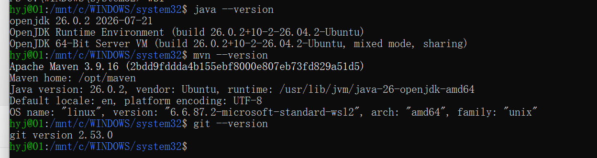
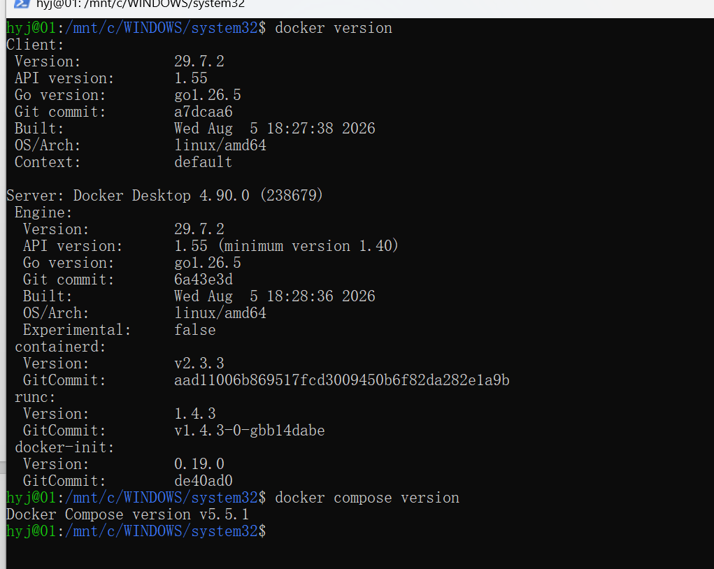
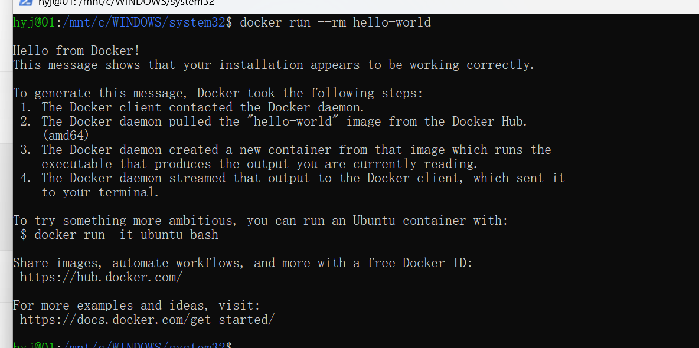
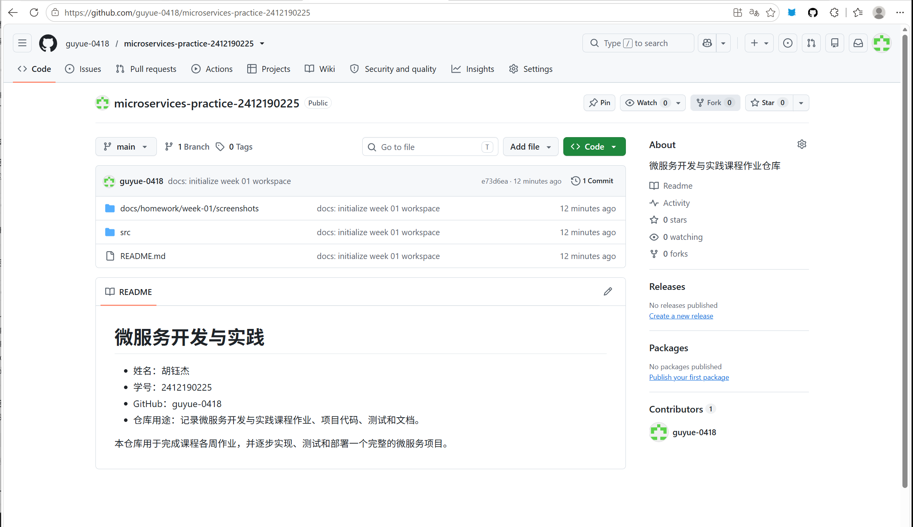
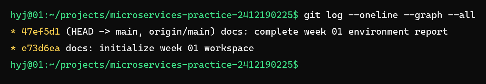

# 作业 01：开发环境与个人仓库

GitHub 仓库：https://github.com/guyue-0418/microservices-practice-2412190225

## 环境检查

执行命令：

```bash
java --version
mvn --version
git --version
docker version
docker compose version
docker run --rm hello-world
```

本机环境结果：

```text
Ubuntu 26.04 LTS
OpenJDK 26.0.2
Apache Maven 3.9.16
Git 2.53.0
Docker Engine 29.7.2
Docker Compose v5.5.1
hello-world 镜像运行成功
```

环境截图：







## 概念回答

1. 微服务架构是将一个应用拆分为多个可以独立开发、部署和运行的小服务。每个服务围绕业务功能构建，并通过 HTTP 等轻量级机制通信。
2. 单体架构只有一个主要部署单元，通常共享数据库；微服务架构可以独立部署、按需扩展，并允许不同服务使用不同技术，但会增加网络通信、运维、数据一致性和测试方面的复杂度。
3. 课程先实现单体系统，是为了先理解业务需求和功能边界，避免一开始就引入分布式系统的复杂性；之后根据清晰的服务边界逐步拆分，可以更直观地比较单体与微服务的区别。
4. 可重复运行的测试或验证脚本能够让结果稳定、可复现，方便发现回归问题，也让老师和其他同学能够独立验证项目环境与功能是否正常。

## 问题记录

1. GitHub HTTPS 在当前网络环境中无法从 WSL 正常连接，最终改用 GitHub SSH 443 通道完成克隆和推送。
2. Docker Hub 直连超时，配置镜像加速后成功运行 `hello-world`。
3. Ubuntu 26.04 放在 D 盘时曾出现 WSL 磁盘挂载访问拒绝，暂时移回 C 盘后系统恢复正常。



